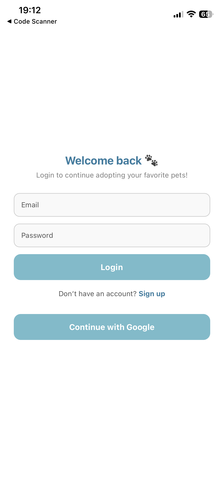
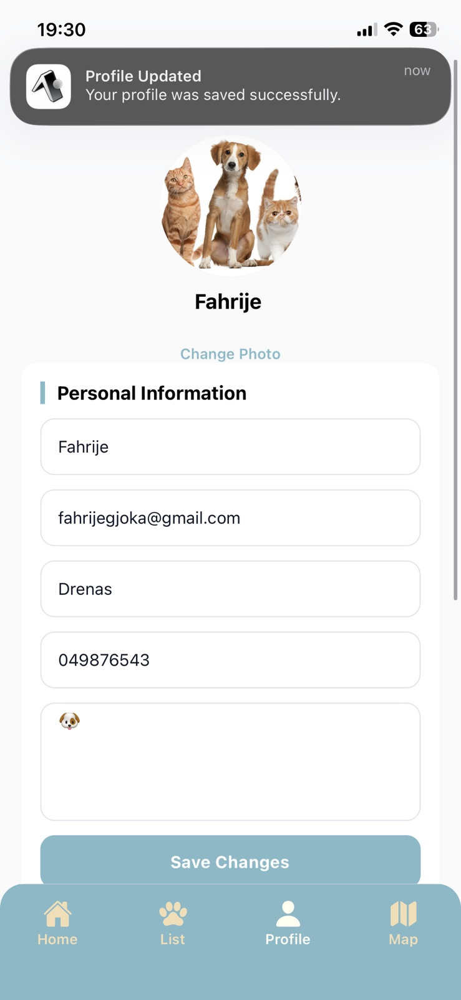
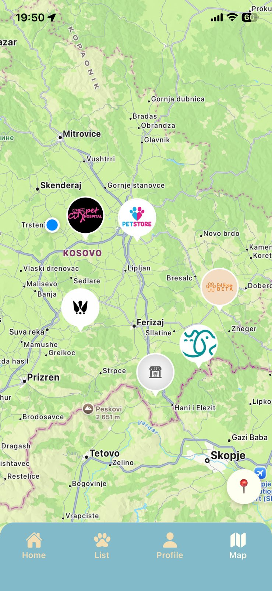
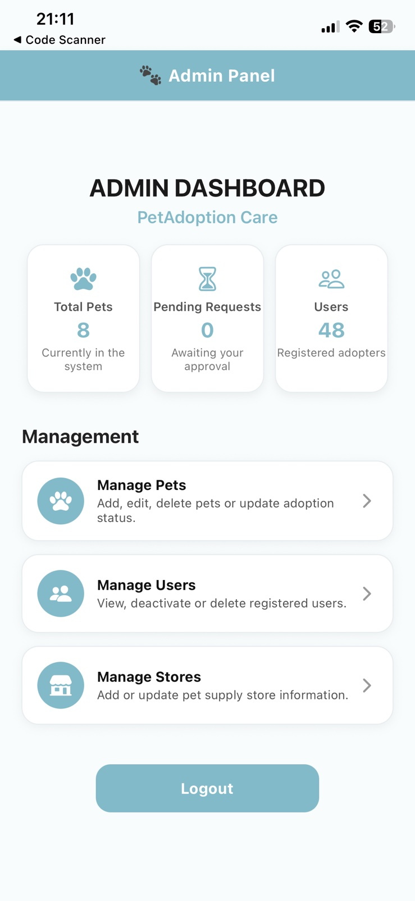
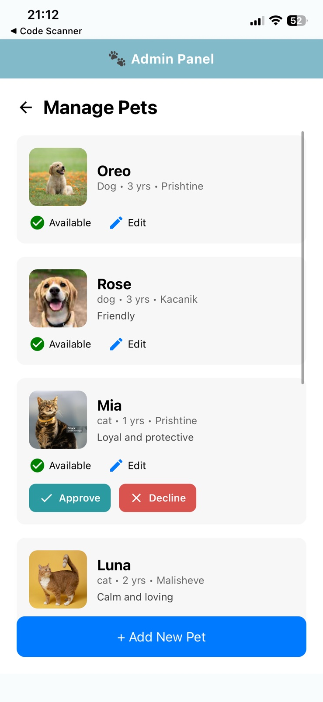
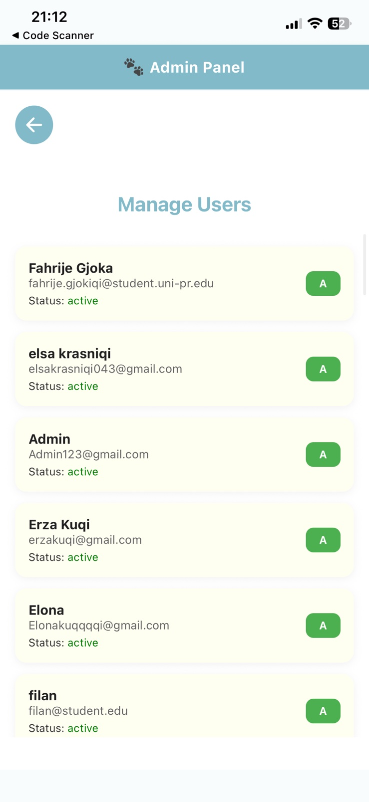
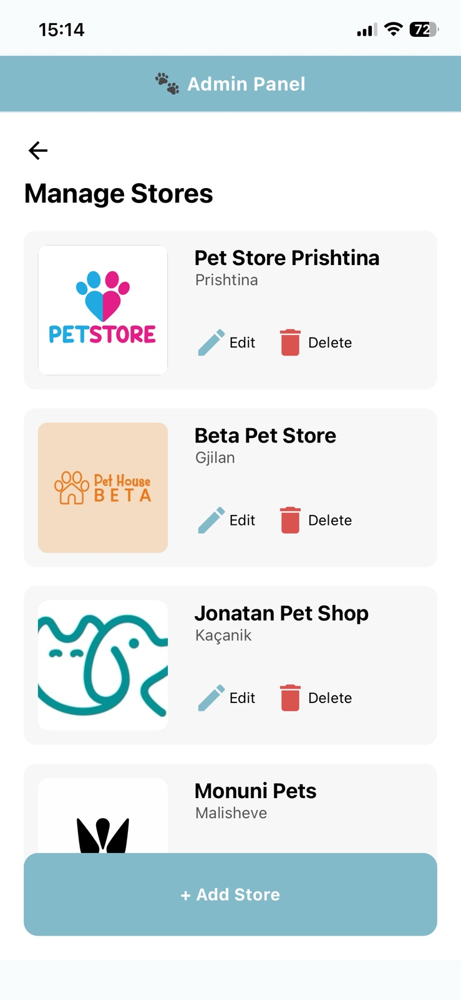
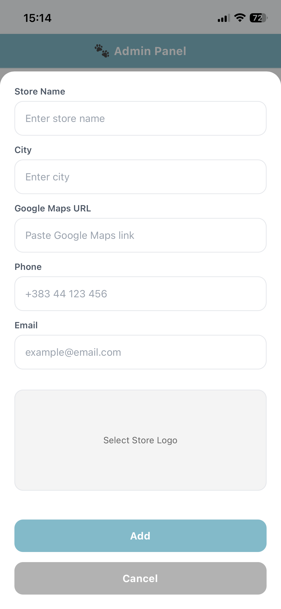

## PetCare Adoption App 


### Grupi: 8
**Lënda:** Programimi për Pajisje Mobile <br>
**Projekti:** Aplikacion mobil për adoptim të kafshëve <br>
**Teknologjia:** React Native (Expo) + Firebase <br>

### Anëtaret e grupit

- Elë Jerlija
- Elona Kuqi
- Elsa Krasniqi
- Erinë Mujku
- Fahrije Gjokiqi
- Florjetë Kuka

### Statusi i projektit: 
Backend funksional (Firebase) <br>
Admin panel funksional <br>
Adoptimi funksional <br>
UI e përfunduar <br>
Harta funksionale <br>
CRUD i mbyllur <br>
Device Features (Image Picker, Local Notifications)<br>
UI/UX (Button press, Modal me fadein/out) <br>
Performance and optimization (FlatList, React memorization, Component Memorization, Asset optimization) <br>
Testing (Snapshot tests, Mocking tests, unit tests) <br>


## Përshkrimi i Projektit

PetCare Adoption është një aplikacion mobil i krijuar për të lidhur përdoruesit me kafshët që kërkojnë shtëpi dhe për të siguruar një platformë të menaxhimit për administratorët (admin panel).

#### Aplikacioni përmban:

Regjistrim dhe hyrje me Firebase Authentication <br>
Ruajtje të të dhënave në Firestore <br>
Role-based access: User dhe Admin <br>
Shfleto kafshët → Detajet → Kërkesë për adoptim <br>
Admin Dashboard (statistika + menaxhim i plotë) <br>
Hartë interaktive me dyqanet e pajisjeve për kafshë <br>
Menaxhim i përdoruesve, kafshëve dhe dyqaneve <br>
UI moderne dhe e unifikuar me komponentë custom <br>

---

## Struktura e ekranëve
**User Screens**

* Home – hyrja fillestare e aplikacionit
* Login / Signup – regjistrimi dhe hyrja me Firebase
* List – lista e kafshëve dhe filtrime
* Pet Details – detajet e një kafshe me mundësi adoptimi
* Favorites – shtegu për kafshët e preferuara (nëse implementohet)
* Profile – shfaqje dhe përditësim i të dhënave personale
* Map – hartë me lokacionet e pet stores

**Admin Screens**

* Admin Dashboard
* Total Pets
* Pending Requests
* Registered Users
* Manage Pets – shtim, editim, fshirje, aprovime adoptimi
* Manage Users – listim, deaktivizim, fshirje
* Manage Stores – shtim/editim të pet supply stores

---

## Funksionalitetet kryesore

**1. Firebase Authentication**

Regjistrim me email + password <br>
Login <br>
Logout <br>
Ruajtje e profilit në Firestore (users collection) <br>
Role: role = "admin" ose role = "user"<br>

**2. Menaxhimi i Pets**

Shtim të kafshëve (Admin) <br>
Editim të të dhënave të kafshës <br>
Fshirje<br>
Shfaqje listash për përdorues<br>
Status: available, pending, approved, declined<br>

**3. Adoption Request System**

Kur një user klikon Adopt, krijohet një kërkesë: <br>
Admin e sheh si Pending <br>
Admin mund ta aprovojë ose refuzojë <br>
Pasi aprovohet → pet zhduket nga lista e pending <br>

**4. Map + Stores**

Firestore ruan dyqanet me:
emër
qytet
lokacion (GeoPoint)
Shfaqen në hartë me markers
Tek klikimi → shfaqen kafshët e disponueshme në atë store

**5. Admin Dashboard Stats**

Kodi i statistikave:
``` dash
const petsSnap = await getDocs(collection(db, "pets"));
setTotalPets(petsSnap.size);

const pendingSnap = await getDocs(
  query(collection(db, "pets"), where("status", "==", "pending"))
);
setPendingRequests(pendingSnap.size);

const usersSnap = await getDocs(collection(db, "users"));
setTotalUsers(usersSnap.size);
```

**Admini sheh:** <br>
Numrin total të kafshëve <br>
Sa kërkesa janë pending <br>
Sa përdorues janë regjistruar<br>

## Komponentët kryesorë
*InputField.jsx* <br>
Komponent i personalizuar për fushat e tekstit <br>
Pranon: label, placeholder, value, onChangeText <br>
Përdoret për login/signup/profile <br>

*PrimaryButton.jsx* <br>
Buton unik i aplikacionit<br>
Props: title, onPress<br>
Ngjyra tematike: #83BAC9<br>
Përdoret në: adopt, save, add pet, logout<br>

*PetCard.jsx*<br>
Kartë vizuale për kafshët<br>
Pranon:pet (objekti i kafshës),onPress<br>
Ka UI me hije, border radius, imazh, status


## Teknologji të përdorura

React Native (Expo)<br>
Expo Router<br>
Firebase Authentication<br>
Firestore Database<br>
React Context API / Hooks<br>
React Native Maps<br>
Expo Vector Icons<br>
Custom UI Components<br>

## Instalimi dhe nisja
``` bash
git clone https://github.com/elejerlija/PetCareAdoptionApp.git
```
``` bash
cd PetCareAdoptionApp
```
``` bash
npm install
```
``` bash
npx expo start
```

## Ekranet e aplikacionit

# Export e aplikacionit

<p align="center">
    
    
    
</p>

<p align="center">
    
    
    
</p>

<p align = "center">
   
   
   
</p>


<p align = "center">
   
   
</p>

